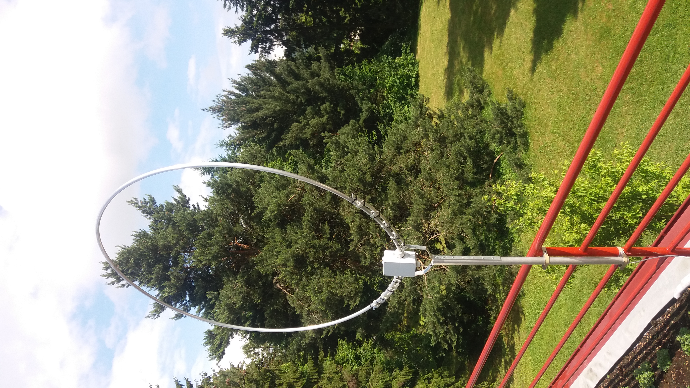
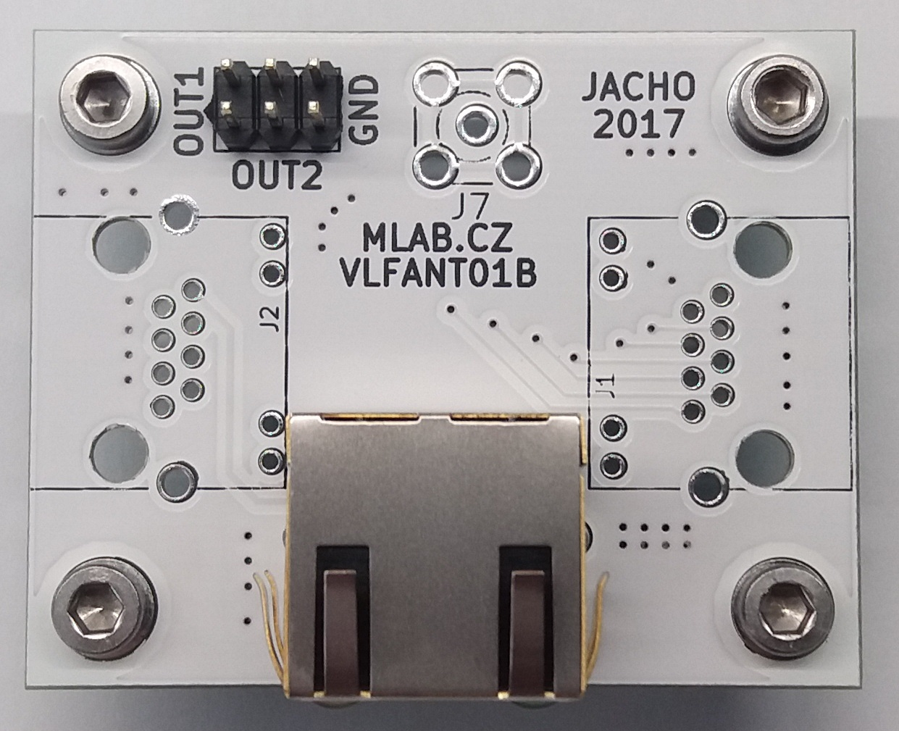
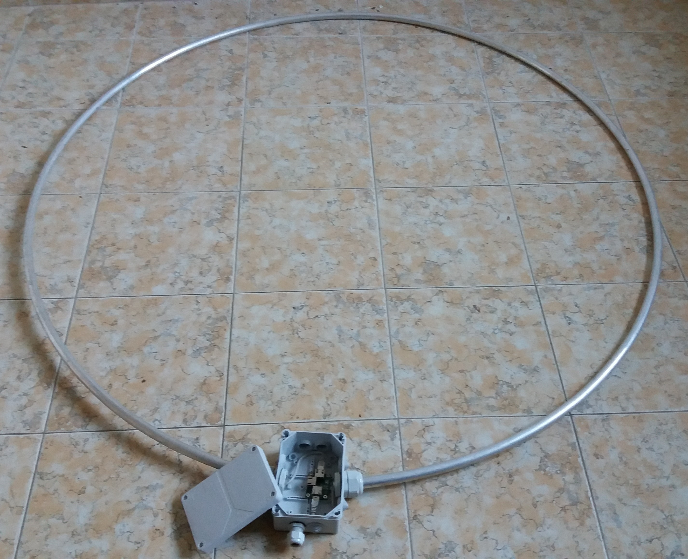
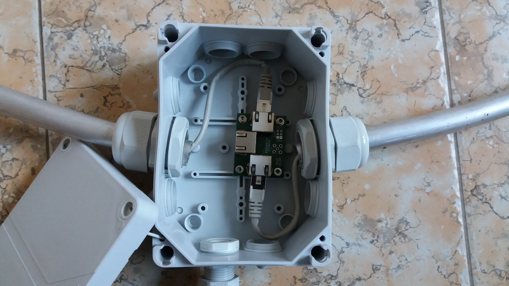

<!--- Name:VLFANT01B: --->
# VLFANT01B
<!--- LongName --->
## VLF antenna interconnection module
<!--- ELongName --->

<!--- Lead --->

<!--- ELead --->

The module is usually used to make a magnetic loop antenna from the UTP pigtail. It is basic antenna for [VLF ionospheric monitoring station](https://github.com/Ionozor/VLFMON01).

<!--- Description --->
<!--- EDescription --->
<!--- Content --->

## Hardware

The module could be used by multiple ways

### Antenna feed end on MLAB board

This usage case uses only one RJ45 connector populated on board. This connector is used for connection the UTP feed from the antenna.

### Antenna connection module

In that situation all three RJ45 connectors are populated on the board. The two are used for connection the antenna loop. The last is used for feeding the signal to the receiver unit.

## VLF antenna construction

The antenna is made from an aluminium tube ring. The parameters of the aluminium tube are not critical. But it is practical to use an tube which allows direct insertion of UTP pigtail including the connectors.
The circumference of the tube ring should match the lengh of UTP cable used. Therefore the example 1.5m circle diameter aproximately match to 5m lenght UTP cable pigtail. In the reality we used the STP (Shilded variant of UTP cable), to minimize possibility of differences between antennas by different shaping of the cable in the tube, which could alter overall capacity, resulting in different resonant frequency. 

<!--- EContent --->
 Generated with [MLABweb](https://github.com/MLAB-project/MLABweb). (2019-09-12)
